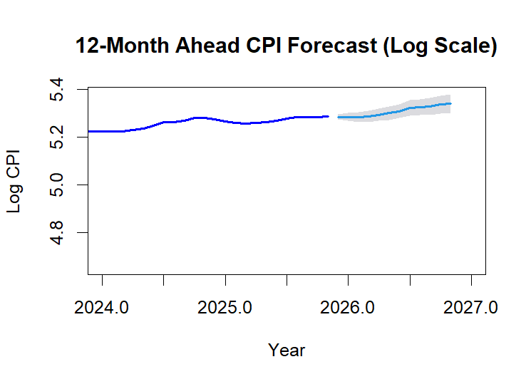

# All-India CPI Index Modeling & Forecasting Framework

An econometric analysis utilizing Seasonal Autoregressive Integrated Moving Average (SARIMA) models to capture short-term inflation momentum and annual seasonal dynamics in India's Consumer Price Index.

---

## 1. Exploratory Data & Non-Stationarity Analysis

The initial phase focuses on understanding the underlying structure of the absolute price level. The raw All-India CPI Combined Index exhibits a strong, persistent long-term upward trend along with visible annual seasonality. 

- **Observations:** The Autocorrelation Function (ACF) for the raw series decays extremely slowly, indicating severe non-stationarity. The Partial Autocorrelation Function (PACF) displays a massive spike at lag 1, revealing strong stochastic trend drift reminiscent of a random walk.

---

## 2. Variance Stabilization & Stationarity Diagnostics

To prepare the data for SARIMA modeling, multiple transformation architectures were evaluated to eliminate both the absolute trend and the annual seasonal variations. 

Standalone first-differencing ($\text{lag} = 1$) and standard seasonal differencing ($\text{lag} = 12$) were independently insufficient, leaving residual trends or introducing erratic seasonal spikes. True stationarity was achieved via a joint approach: applying a natural log transformation to stabilize variance, followed by a dual-integration step ($d=1, D=1$).

- **Statistical Verification:** The resulting twice-differenced log series was subjected to an Augmented Dickey-Fuller (ADF) unit-root test. The test rejected the null hypothesis of non-stationarity ($p \le 0.01$), formally certifying the series as stationary and ready for estimation.

---

## 3. SARIMA Optimization & Residual Diagnostics

Using an unconstrained optimization sweep via Maximum Likelihood Estimation (MLE), the optimal model structure identified is a **$\text{SARIMA}(2,1,0)(1,1,1)_{12}$** process. 

This model isolates two operational layers:
1. **The Core Components:** An $\text{AR}(2)$ structure handles short-term monthly momentum.
2. **The Seasonal Components:** A joint $\text{SAR}(1)$ and $\text{SMA}(1)$ engine operates at a 12-month lag to cleanly absorb annual echoes and seasonal shock variances.

- **Diagnostic Performance:** The model passes all rigorous statistical diagnostics. The residual ACF demonstrates that the prominent annual seasonal spikes have been completely suppressed within the 95% confidence thresholds. 
- **Ljung-Box Test:** A formal Ljung-Box test yields a test statistic $p\text{-value} = 0.9095$. Since $p > 0.05$, we fail to reject the null hypothesis of independence, validating that the residuals are completely uncorrelated **white noise** and all systematic information has been extracted.

---

## 4. 12-Month Out-of-Sample Projections

With the model diagnostics validated, forward projections were generated for a 12-month out-of-sample forecast horizon. 

- **Interpretation:** The forecast line smoothly extends the underlying macroeconomic trend, successfully integrating seasonal cyclicality. The single, clean 95% confidence interval envelope provides clear statistical boundaries for future CPI tracking and risk management scenarios.

---

## Technical Stack & Libraries
- **Language:** R (100%)
- **Core Packages:** `dplyr` (data wrangling), `tseries` (ADF stationarity testing), `forecast` (SARIMA modeling, automatic optimization, and out-of-sample projections).
